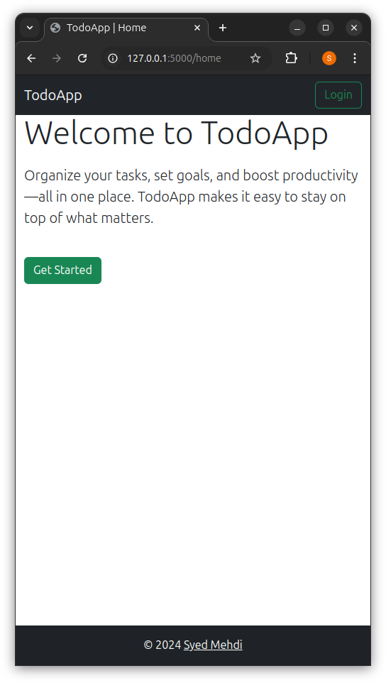
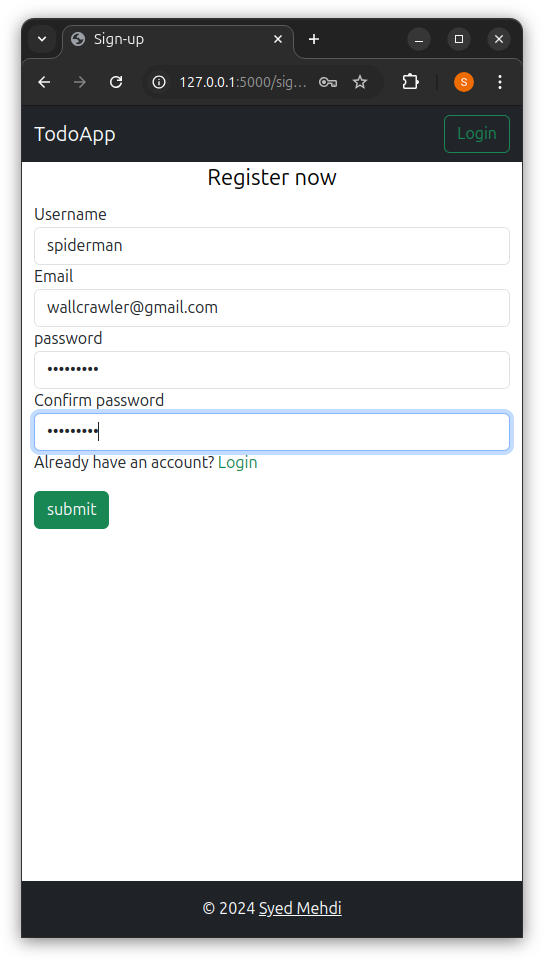
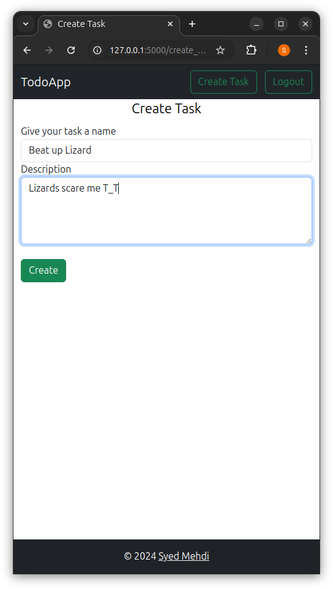
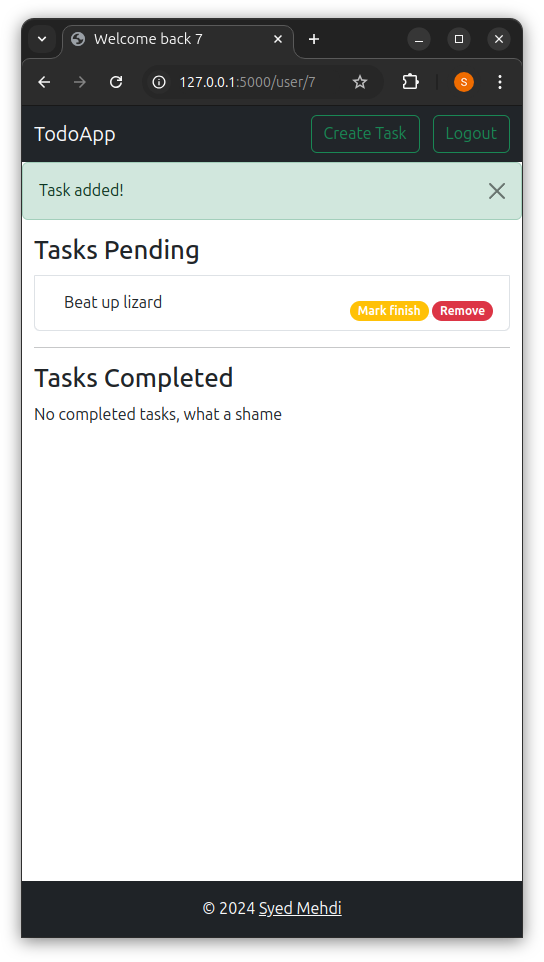
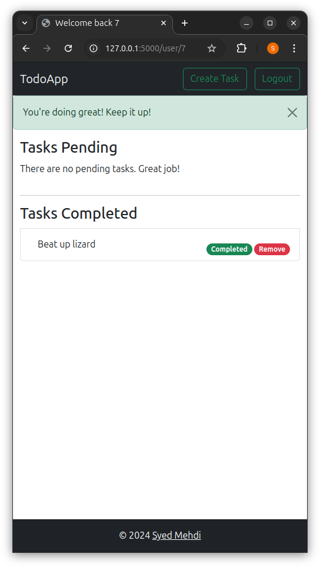

# todo-app

A simple, user-friendly todo list app built with Flask. This app allows users to add, remove, delete and update tasks as complete.

## Live demo

- https://todo-app-aq46.onrender.com/

## Features

- Sign-up and Sign-in functionality
- User authentication
- Add new tasks
- Delete tasks
- Update task status

## Technologies Used

- Python
- Flask
- HTML
- CSS
- BootStrap
- Sqlite

## Installation

To run the app locally, follow these steps:
1. Clone the repository:
```bash
git clone git@github.com:Infamous003/todo-app.git
```

2. Navigate into the project directory:
```bash
cd todo-app
```

3. Set up a virtual environment: 
```bash
python3 -m venv venv
source venv/bin/activate
# On windows use `venv\Scripts\activate`
```

4. Install the required dependencies:
```bash
pip install -r requirements.txt
```

5. Run the app:
```bash
python run.py
```

6. Open http://127.0.0.1:5000/ in your browser to see the app in action!

## Screenshots

### Home Page


### Sign-up page


### Create Tasks Page


### Tasks Pending


### Completed Tasks
